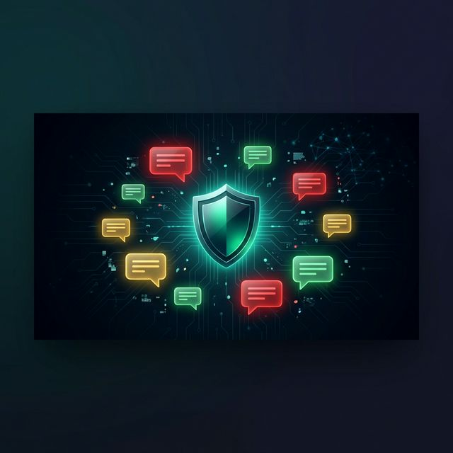
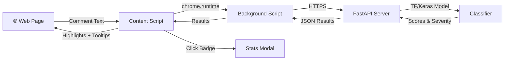

# 🛡️ ToxGuard — Toxic Comment Classifier

<p align="center">
  
</p>

<p align="center">
  
  
  
  
  
</p>

A **Chrome extension + FastAPI backend** that scans web pages for toxic comments and highlights them with a three-tier classification system.

> **🔴 Toxic** (3+ categories flagged) · **🟡 Medium** (1–2 categories) · **🟢 Safe**

---

## ✨ Features

| Feature | Description |
|---------|-------------|
| **One-Click Scan** | Analyze any web page's comments instantly |
| **Three-Tier Classification** | Red / Yellow / Green severity with glowing borders |
| **6 Toxicity Categories** | Toxic, Severe Toxic, Obscene, Threat, Insult, Identity Hate |
| **User ID Extraction** | Detects comment authors on YouTube, Reddit & X/Twitter |
| **Stats Modal** | Click the badge → detailed report with category bars & flagged comments |
| **CSV Export** | Download results with author, severity, and per-category scores |
| **Adjustable Threshold** | Fine-tune sensitivity with the slider |
| **Cross-Browser** | Works on Chrome, Edge, Brave, Opera, Vivaldi, Arc |
| **Privacy-First** | Model runs on your server — no data sold to third parties |
| **Keyboard Shortcut** | `Ctrl+Shift+T` (Mac: `⌘+Shift+T`) opens the popup |
| **JSDoc Typed** | Full IntelliSense — hover any function for docs + type info |

---

## 🏗️ Architecture



**Key design decisions:**
- Author/user IDs are extracted **client-side only** — never sent to the server
- The server receives only comment text and returns classification scores
- All highlighting, modals, and export happen in the browser

---

## 📁 Project Structure

```
Toxic_Comment_Classifier/
├── extension/                    # Chrome Extension (Manifest V3)
│   ├── manifest.json             # Extension config & permissions
│   ├── background.js             # Service worker — API bridge
│   ├── content.js                # Orchestrator — scan, highlight, modal
│   ├── content-styles.js         # All injected CSS (highlights, modal, badge)
│   ├── platforms.js              # Platform detection & author extraction
│   ├── config.js                 # API base URL, defaults
│   ├── popup.html / .js / .css   # Extension popup UI
│   ├── options.html / .js / .css # Settings page
│   ├── jsconfig.json             # VS Code IntelliSense & type checking
│   └── icons/                    # Extension icons (16/48/128px)
│
├── server/                       # FastAPI Backend
│   ├── app/
│   │   ├── main.py               # API endpoints (/health, /predict)
│   │   ├── classifier.py         # TF/Keras model + 3-tier prediction
│   │   ├── config.py             # Environment configuration
│   │   └── middleware.py         # Rate limiting + security headers
│   ├── models/                   # ML model files (tox_model.h5, tokenizer.pickle)
│   ├── tests/                    # pytest suite for API
│   ├── Dockerfile                # Container support
│   ├── .env.example              # Sample env config
│   └── requirements.txt
│
├── streamlit/                    # Streamlit Demo App
│   ├── app.py                    # Interactive web demo
│   └── requirements.txt
│
├── docs/
│   ├── privacy-policy.md         # Chrome Web Store privacy policy
│   └── assets/                   # Images & media
│
├── LICENSE                       # MIT License
└── README.md
```

---

## 🚀 Quick Start

The extension is pre-configured to use the **hosted server on Hugging Face** — no backend setup required.

### 1. Load the Chrome Extension

```bash
git clone https://github.com/am-govind/Toxic_Comment_Classifier.git
```

1. Open `chrome://extensions/` in any Chromium browser
2. Enable **Developer mode** (top right toggle)
3. Click **Load unpacked** → select the `extension/` folder
4. Visit any page with comments → click the 🛡️ ToxGuard icon → **Scan Page**

**That's it!** The extension connects to `https://amgovind-toxguard.hf.space` automatically.

> **Note:** The hosted server runs on HuggingFace's free tier. It may take 30–60 seconds to wake from sleep on the first request after a period of inactivity.

### 2. (Optional) Run the Server Locally

If you want to self-host the backend for faster response times or development:

```bash
cd Toxic_Comment_Classifier/server

# Create virtual environment
python -m venv tcc && source tcc/bin/activate

# Install dependencies
pip install -r requirements.txt

# Configure
cp .env.example .env

# Run
python -m app.main
```

The API will be running at `http://localhost:4000`. To use it with the extension, go to the ToxGuard extension **Options page** (right-click icon → Options) and change the API URL to `http://localhost:4000`.

### 3. (Optional) Streamlit Demo

```bash
cd streamlit
pip install -r requirements.txt
streamlit run app.py
```

---

## 🔌 API Reference

### `GET /health`

Health check endpoint.

```json
{ "status": "healthy", "model_loaded": true }
```

### `POST /predict`

Classify an array of comments.

**Headers:**
| Header | Required | Description |
|--------|----------|-------------|
| `X-API-Key` | Yes (prod) | API authentication key |
| `Content-Type` | Yes | `application/json` |

**Request Body:**
```json
{
  "comments": ["Hello!", "You're an idiot"],
  "threshold": 0.5
}
```

**Response:**
```json
{
  "results": [
    {
      "text": "Hello!",
      "is_toxic": false,
      "severity": "safe",
      "flagged_categories": 0,
      "scores": {
        "toxic": 0.02, "severe_toxic": 0.00, "obscene": 0.01,
        "threat": 0.00, "insult": 0.01, "identity_hate": 0.00
      }
    },
    {
      "text": "You're an idiot",
      "is_toxic": true,
      "severity": "medium",
      "flagged_categories": 2,
      "scores": {
        "toxic": 0.92, "severe_toxic": 0.05, "obscene": 0.34,
        "threat": 0.01, "insult": 0.87, "identity_hate": 0.02
      }
    }
  ]
}
```

**cURL Example:**
```bash
curl -X POST https://amgovind-toxguard.hf.space/predict \
  -H "Content-Type: application/json" \
  -H "X-API-Key: your-api-key" \
  -d '{"comments": ["Hello!", "You are terrible!"], "threshold": 0.5}'
```

---

## 🔧 Configuration

### Server (`server/.env`)

| Variable | Default | Description |
|----------|---------|-------------|
| `PORT` | `4000` | Server port |
| `API_KEY` | `toxguard-dev-key-change-me` | API authentication key |
| `CORS_ORIGINS` | `["*"]` | Allowed CORS origins |
| `RATE_LIMIT` | `30/minute` | Request rate limit |
| `MAX_COMMENT_LENGTH` | `500` | Max characters per comment |

### Extension (`extension/config.js`)

| Setting | Default | Description |
|---------|---------|-------------|
| `API_BASE` | `https://amgovind-toxguard.hf.space` | Backend URL |
| `API_KEY` | *(empty)* | Can also be set via Options page |
| `DEFAULT_THRESHOLD` | `0.5` | Default toxicity threshold |

---

## 🧪 Testing

```bash
cd server
source tcc/bin/activate
python -m pytest tests/ -v --tb=short
```

---

## 🐳 Docker

```bash
cd server
docker build -t toxguard-server .
docker run -p 4000:4000 --env-file .env toxguard-server
```

---

## 🌐 Browser Compatibility

ToxGuard uses **Manifest V3** and standard `chrome.*` APIs, so it works on all Chromium-based browsers:

| Browser | Supported |
|---------|-----------|
| Google Chrome | ✅ |
| Microsoft Edge | ✅ |
| Brave | ✅ |
| Opera | ✅ |
| Vivaldi | ✅ |
| Arc | ✅ |

---

## 👤 Supported Platforms for Author Extraction

| Platform | Author Format | Method |
|----------|---------------|--------|
| YouTube | Channel name | `ytd-comment-renderer` → `#author-text` |
| Reddit | `u/username` | `shreddit-comment[author]` attribute |
| X / Twitter | `@handle` | `[data-testid='User-Name']` links |
| Other sites | `Unknown` | Fallback |

> **Note:** Author extraction relies on platform-specific DOM selectors. These may need periodic updates when platforms change their HTML structure.

---

## 📜 License

MIT — see [LICENSE](LICENSE) for details.

## 🔒 Privacy

ToxGuard respects your privacy. Comment text is processed in-memory and immediately discarded. No personal data is collected or stored. See the full [Privacy Policy](docs/privacy-policy.md).

---

<p align="center">
  Made with ❤️ by <a href="https://github.com/am-govind">Govind Mishra</a>
</p>
